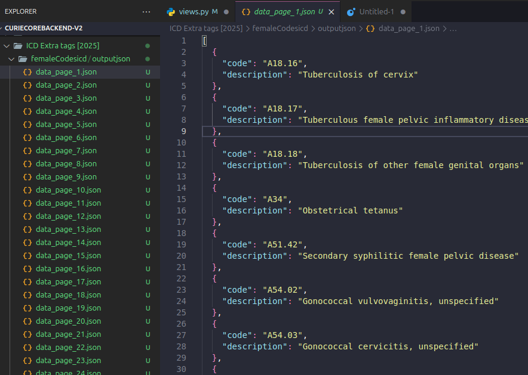

1. processing-large-no-of-files-and-files-data-update-effectively-to-db

sceanrio:

i have n number of files(json) and each file have n number of list of objects each object have {code and description}

all these files comes under a folder called female

i have table called icd i need to update icd extratags field value

so read all codes from all files and update to db extra tag field value to female



# solution
To optimize your code for updating records and processing each file, the following enhancements can be applied:

### Optimization Plan

1. **Batch Processing of Files**:
   - Instead of processing files one by one, load data from all files in a single step.
   - Minimize the number of database queries by aggregating all the required codes first.

2. **Bulk Database Updates**:
   - Avoid calling `record.save()` in a loop. Use Django's `bulk_update()` or `update()` to perform batch updates for better performance.

3. **Efficient Code Filtering**:
   - Retrieve all relevant database records in a single query instead of fetching them in multiple iterations.

4. **Avoid Overwriting Existing Tags**:
   - Ensure you're only appending new tags to avoid redundant data processing.

5. **Parallel File Processing (Optional)**:
   - For further optimization, use Python's multiprocessing to process files concurrently if the folder contains a large number of files.

### Optimized Code

Here’s the optimized version of your function:

```python
from django.db.transaction import atomic
import os
import json
from icd.models import IcdDataCode_CM_2023

@atomic
def load_extra_tags():
    # Clear all extra tags initially
    IcdDataCode_CM_2023.objects.using('secondary').update(extraTags=[])

    # Define folder path
    female_tags_folder = "/home/bhargav-wl/workspace/curieCoreBackend-v2/ICD Extra tags [2025]/femaleCodesicd/output"

    # Load all files and aggregate codes
    all_codes = set()
    for file in os.listdir(female_tags_folder):
        file_path = os.path.join(female_tags_folder, file)
        with open(file_path, 'r') as jf:
            child_file = json.load(jf)
            all_codes.update(x['code'] for x in child_file)

    # Fetch all matching records in one query
    records = list(
        IcdDataCode_CM_2023.objects.using('secondary').filter(code__in=all_codes)
    )

    # Update records with new extra tag
    for record in records:
        if 'female' not in record.extraTags:  # Avoid redundant tags
            record.extraTags.append('female')

    # Bulk update the records
    IcdDataCode_CM_2023.objects.using('secondary').bulk_update(records, ['extraTags'])
```

### Key Improvements in the Code

1. **Batch Loading of Data**:
   - All files are read in a loop, and the codes are aggregated into a single set. This reduces the number of file I/O operations.

2. **Single Database Query for Fetching Records**:
   - Instead of fetching records in multiple queries, we fetch all matching records in one go using `.filter(code__in=all_codes)`.

3. **Avoid Redundant Tags**:
   - Check if the tag ('female') is already in `extraTags` before appending it.

4. **Bulk Update**:
   - Instead of calling `record.save()` for each record, we use `bulk_update()` for efficient database operations.

### Potential Enhancements (Optional)

- **Parallel Processing**: If there are a significant number of files to process, the file processing loop can be parallelized using `concurrent.futures` for improved performance.

Here’s how it could be done:

```python
from concurrent.futures import ThreadPoolExecutor

def process_file(file_path):
    with open(file_path, 'r') as jf:
        return [x['code'] for x in json.load(jf)]

@atomic
def load_extra_tags():
    IcdDataCode_CM_2023.objects.using('secondary').update(extraTags=[])

    female_tags_folder = "/path/to/folder"
    file_paths = [os.path.join(female_tags_folder, file) for file in os.listdir(female_tags_folder)]

    # Parallel file processing
    with ThreadPoolExecutor() as executor:
        all_codes = set()
        for codes in executor.map(process_file, file_paths):
            all_codes.update(codes)

    records = list(IcdDataCode_CM_2023.objects.using('secondary').filter(code__in=all_codes))

    for record in records:
        if 'female' not in record.extraTags:
            record.extraTags.append('female')

    IcdDataCode_CM_2023.objects.using('secondary').bulk_update(records, ['extraTags'])
```

### Benefits of Optimization

1. **Reduced I/O Overhead**:
   - Aggregating data from all files minimizes the overhead of multiple file operations.

2. **Database Query Efficiency**:
   - Fetching and updating data in bulk significantly reduces the number of database hits, improving performance.

3. **Scalability**:
   - The code can now handle a large number of records and files efficiently.

### Testing
Make sure to test this optimized function with sample data to ensure correctness and performance. Adjust file paths and database configurations as necessary.